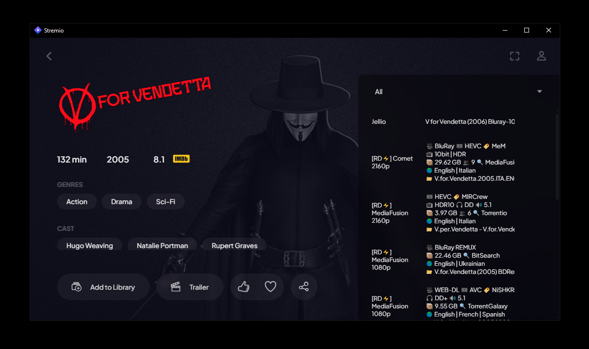
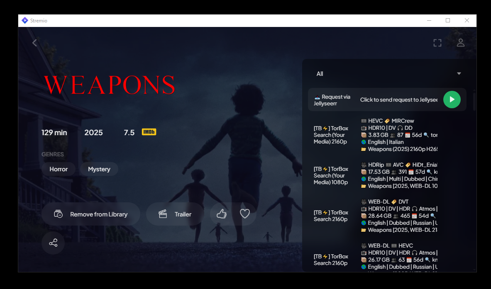

# Jellio+# Jellio+ 🎬# Jellio+ 🎬# Jellio (Fork)


> Stream your Jellyfin library directly in Stremio with seamless integration


[](https://jellyfin.org/)> **Stream your Jellyfin library directly in Stremio with seamless integration**

[](https://dotnet.microsoft.com/)

[](LICENSE)

[](https://github.com/InfiniteAvenger/jellio-plus/releases)

[](https://jellyfin.org/)> **Stream your Jellyfin library directly in Stremio with seamless integration**This is a fork of [Vanchaxy’s Jellio plugin](https://github.com/vanchaxy/jellio), which connects Jellyfin to Stremio so you can stream your Jellyfin library inside Stremio.

Jellio+ is a modern fork of [Vanchaxy's original Jellio plugin](https://github.com/vanchaxy/jellio), updated and enhanced for **Jellyfin 10.11.x** compatibility. This plugin creates a bridge between your Jellyfin media server and Stremio, allowing you to stream your personal media library directly within the Stremio interface.

[](https://dotnet.microsoft.com/)

## Features

[](LICENSE)This fork is updated for **Jellyfin 10.11.2**.

- **Full Library Integration** - Access your entire Jellyfin movie and TV show collection in Stremio

- **Smart Search** - Find content across your Jellyfin libraries with Stremio's search functionality  [](https://github.com/InfiniteAvenger/jellio-plus/releases)

- **Cross-Platform** - Works on all Stremio-supported devices (Windows, macOS, Linux, Android, iOS)

- **Jellyseer Integration** - Optional integration with Jellyseer for content requests[](https://jellyfin.org/)

- **High Performance** - Optimized for Jellyfin 10.11.x with .NET 9

- **Secure Access** - Respects Jellyfin user permissions and authenticationJellio+ is a modern fork of [Vanchaxy's original Jellio plugin](https://github.com/vanchaxy/jellio), updated and enhanced for **Jellyfin 10.11.x** compatibility. This plugin creates a bridge between your Jellyfin media server and Stremio, allowing you to stream your personal media library directly within the Stremio interface.

- **Rich Metadata** - Displays posters, descriptions, ratings, and cast information

- **Multiple Formats** - Supports various video codecs and quality options[](https://dotnet.microsoft.com/)All credit for the original work goes to Vanchaxy. This version includes small updates to keep the plugin working with the latest Jellyfin release.


## Screenshots## ✨ Features


### Browsing Your Library in Stremio[](LICENSE)



*Access your Jellyfin movies with full metadata, multiple quality options, and streaming sources*- 🎭 **Full Library Integration** - Access your entire Jellyfin movie and TV show collection in Stremio


### Content Discovery and Requests- 🔍 **Smart Search** - Find content across your Jellyfin libraries with Stremio's search functionality  [](https://github.com/InfiniteAvenger/jellio-plus/releases)---

  

*Browse and discover content with Jellyseer integration for seamless requesting*- 📱 **Cross-Platform** - Works on all Stremio-supported devices (Windows, macOS, Linux, Android, iOS)


## Quick Start- 🎯 **Jellyseer Integration** - Optional integration with Jellyseer for content requests


### Installation- ⚡ **High Performance** - Optimized for Jellyfin 10.11.x with .NET 9


**Method 1: Repository Installation (Recommended)**- 🔐 **Secure Access** - Respects Jellyfin user permissions and authenticationJellio+ is a modern fork of [Vanchaxy's original Jellio plugin](https://github.com/vanchaxy/jellio), updated and enhanced for **Jellyfin 10.11.x** compatibility. This plugin creates a bridge between your Jellyfin media server and Stremio, allowing you to stream your personal media library directly within the Stremio interface.## Install


1. Open Jellyfin Dashboard > **Plugins** > **Repositories**- 🎨 **Rich Metadata** - Displays posters, descriptions, ratings, and cast information

2. Add the repository URL:

   ```- 📺 **Multiple Formats** - Supports various video codecs and quality options

   https://raw.githubusercontent.com/InfiniteAvenger/jellio-plus/metadata/jellyfin-repo-manifest.json

   ```

3. Navigate to **Plugins** > **Catalog**

4. Search for "Jellio" and click **Install**## 🖼️ Screenshots## ✨ Features**Option 1: From Repository**

5. Restart your Jellyfin server


**Method 2: Manual Installation**

### Browsing Your Library in Stremio

1. Download the latest release from [GitHub Releases](https://github.com/InfiniteAvenger/jellio-plus/releases)

2. Extract the ZIP file to your Jellyfin plugins directory:

   - **Windows**: `C:\ProgramData\Jellyfin\Server\plugins\Jellio\`

   - **Linux**: `/var/lib/jellyfin/plugins/Jellio/`*Access your Jellyfin movies with full metadata, multiple quality options, and streaming sources*- 🎭 **Full Library Integration** - Access your entire Jellyfin movie and TV show collection in Stremio1. In Jellyfin, go to **Dashboard → Plugins → Repositories**

   - **Docker**: `/config/plugins/Jellio/`

3. Restart Jellyfin


### Configuration### Content Discovery & Requests- 🔍 **Smart Search** - Find content across your Jellyfin libraries with Stremio's search functionality  2. Add this URL:


1. **Access Plugin Settings**  

   ```

   https://your-jellyfin-server:8096/jellio*Browse and discover content with Jellyseer integration for seamless requesting*- 📱 **Cross-Platform** - Works on all Stremio-supported devices (Windows, macOS, Linux, Android, iOS)

   ```


2. **Configure Libraries**

   - Select which Jellyfin libraries to expose (Movies, TV Shows, etc.)## 🚀 Quick Start- 🎯 **Jellyseer Integration** - Optional integration with Jellyseer for content requests   ```

   - Set content filtering preferences


3. **Jellyseer Integration** (Optional)

   - Add your Jellyseer server URL### Installation- ⚡ **High Performance** - Optimized for Jellyfin 10.11.x with .NET 9   https://raw.githubusercontent.com/InfiniteAvenger/jellio-plus/metadata/jellyfin-repo-manifest.json

   - Enter your Jellyseer API key

   - Enable request functionality


4. **Generate Addon URL****Method 1: Repository Installation (Recommended)**- 🔐 **Secure Access** - Respects Jellyfin user permissions and authentication   ```

   - Copy the generated Stremio addon URL

   - Note: This URL is unique to your setup


5. **Install in Stremio**1. Open Jellyfin Dashboard → **Plugins** → **Repositories**- 🎨 **Rich Metadata** - Displays posters, descriptions, ratings, and cast information3. Go to **Plugins → Catalog**, find **Jellio**, and install it

   - Open Stremio > **Addons** > **Community Addons**

   - Click **Add via URL**2. Add the repository URL:

   - Paste your addon URL and install

   ```- 📺 **Multiple Formats** - Supports various video codecs and quality options4. Restart Jellyfin

## Requirements

   https://raw.githubusercontent.com/InfiniteAvenger/jellio-plus/metadata/jellyfin-repo-manifest.json

| Component | Version | Notes |

|-----------|---------|-------|   ```

| **Jellyfin** | 10.11.0+ | Latest stable release recommended |

| **.NET Runtime** | 9.0 | Included with Jellyfin 10.11.x |3. Navigate to **Plugins** → **Catalog**

| **Stremio** | Latest | Desktop or mobile app |

| **Network Access** | - | Stremio must reach your Jellyfin server |4. Search for "Jellio" and click **Install**## 🖼️ Screenshots**Option 2: Manual**


## Architecture5. Restart your Jellyfin server


```

┌─────────────┐    ┌──────────────┐    ┌─────────────┐

│   Stremio   │◄──►│   Jellio+    │◄──►│  Jellyfin   │**Method 2: Manual Installation**

│   Client    │    │   Plugin     │    │   Server    │

└─────────────┘    └──────────────┘    └─────────────┘### Browsing Your Library in Stremio1. Download the latest `.zip` from [Releases](https://github.com/InfiniteAvenger/jellio-plus/releases)

                           │

                           ▼1. Download the latest release from [GitHub Releases](https://github.com/InfiniteAvenger/jellio-plus/releases)

                   ┌──────────────┐

                   │  Jellyseer   │2. Extract the ZIP file to your Jellyfin plugins directory:2. Extract it to your Jellyfin plugins folder

                   │  (Optional)  │

                   └──────────────┘   - **Windows**: `C:\ProgramData\Jellyfin\Server\plugins\Jellio\`

```

   - **Linux**: `/var/lib/jellyfin/plugins/Jellio/`*Access your Jellyfin movies with full metadata, multiple quality options, and streaming sources*

## Use Cases

   - **Docker**: `/config/plugins/Jellio/`

- **Personal Media Streaming** - Access your movie and TV show collection anywhere

- **Family Sharing** - Share your library with family members through Stremio3. Restart Jellyfin   * Windows: `C:\ProgramData\Jellyfin\Server\plugins\Jellio\`

- **Content Discovery** - Browse your collection with Stremio's intuitive interface

- **Mobile Access** - Stream to phones and tablets via Stremio mobile apps

- **Request Management** - Allow users to request new content via Jellyseer integration

### Configuration### Content Discovery   * Linux: `/var/lib/jellyfin/plugins/Jellio/`

## Security Considerations


- Plugin respects Jellyfin user authentication and permissions

- Addon URLs contain authentication tokens so keep them private1. **Access Plugin Settings**     * Docker: `/config/plugins/Jellio/`

- Consider using HTTPS for your Jellyfin server

- Review network access policies for external Stremio access   ```


## Troubleshooting   https://your-jellyfin-server:8096/jellio*Browse and discover content with Jellyseer integration for seamless requesting*3. Restart Jellyfin


**Plugin not appearing in Stremio:**   ```

- Verify the addon URL is correct

- Check that Jellyfin is accessible from your device

- Ensure the plugin is active in Jellyfin settings

2. **Configure Libraries**

**No content showing:**

- Confirm libraries are selected in plugin configuration   - Select which Jellyfin libraries to expose (Movies, TV Shows, etc.)## 🚀 Quick Start---

- Check Jellyfin user permissions for selected libraries

- Verify content has proper metadata   - Set content filtering preferences


**Performance issues:**

- Ensure adequate server resources

- Check network bandwidth between Stremio and Jellyfin3. **Jellyseer Integration** (Optional)

- Consider adjusting streaming quality settings

   - Add your Jellyseer server URL### Installation## Setup

## Contributing

   - Enter your Jellyseer API key

We welcome contributions! This is a community-maintained fork focused on keeping Jellio compatible with modern Jellyfin releases.

   - Enable request functionality

1. Fork the repository

2. Create a feature branch

3. Make your changes

4. Submit a pull request4. **Generate Addon URL****Method 1: Repository Installation (Recommended)**1. Open the plugin at:


## License   - Copy the generated Stremio addon URL


This project is licensed under the MIT License - see the [LICENSE](LICENSE) file for details.   - Note: This URL is unique to your setup


## Acknowledgments


- **Vanchaxy** - Original Jellio plugin creator5. **Install in Stremio**1. Open Jellyfin Dashboard → **Plugins** → **Repositories**   ```

- **Jellyfin Team** - Amazing media server platform  

- **Stremio Team** - Excellent streaming platform   - Open Stremio → **Addons** → **Community Addons**

- **Community Contributors** - Bug reports, testing, and feedback

   - Click **Add via URL**2. Add the repository URL:   https://<your-jellyfin-server>/jellio

## Support

   - Paste your addon URL and install

- **Bug Reports**: [GitHub Issues](https://github.com/InfiniteAvenger/jellio-plus/issues)

- **Discussions**: [GitHub Discussions](https://github.com/InfiniteAvenger/jellio-plus/discussions)   ```   ```

- **Documentation**: [Wiki](https://github.com/InfiniteAvenger/jellio-plus/wiki)

## 🔧 Requirements

---

   https://raw.githubusercontent.com/InfiniteAvenger/jellio-plus/metadata/jellyfin-repo-manifest.json2. Add your Jellyseer **API Key** and Jellyseer address.

<div align="center">

<strong>Made with care for the Jellyfin and Stremio communities</strong>| Component | Version | Notes |

</div>
|-----------|---------|-------|   ```3. Choose which libraries (Movies, TV Shows) to expose

| **Jellyfin** | 10.11.0+ | Latest stable release recommended |

| **.NET Runtime** | 9.0 | Included with Jellyfin 10.11.x |3. Navigate to **Plugins** → **Catalog**4. Copy the generated addon URL

| **Stremio** | Latest | Desktop or mobile app |

| **Network Access** | - | Stremio must reach your Jellyfin server |4. Search for "Jellio" and click **Install**5. In Stremio, go to **Addons → Community Addons → Add via URL**, paste it, and install


## 🏗️ Architecture5. Restart your Jellyfin server


```---

┌─────────────┐    ┌──────────────┐    ┌─────────────┐

│   Stremio   │◄──►│   Jellio+    │◄──►│  Jellyfin   │**Method 2: Manual Installation**

│   Client    │    │   Plugin     │    │   Server    │

└─────────────┘    └──────────────┘    └─────────────┘## Requirements

                           │

                           ▼1. Download the latest release from [GitHub Releases](https://github.com/InfiniteAvenger/jellio-plus/releases)

                   ┌──────────────┐

                   │  Jellyseer   │2. Extract the ZIP file to your Jellyfin plugins directory:* Jellyfin 10.11.0 or higher

                   │  (Optional)  │

                   └──────────────┘   - **Windows**: `C:\ProgramData\Jellyfin\Server\plugins\Jellio\`* .NET 9 (included with Jellyfin 10.11.x)

```

   - **Linux**: `/var/lib/jellyfin/plugins/Jellio/`* Stremio with internet access to your Jellyfin server

## 🎯 Use Cases

   - **Docker**: `/config/plugins/Jellio/`

- **Personal Media Streaming** - Access your movie and TV show collection anywhere3. Restart Jellyfin

- **Family Sharing** - Share your library with family members through Stremio

- **Content Discovery** - Browse your collection with Stremio's intuitive interface### Configuration

- **Mobile Access** - Stream to phones and tablets via Stremio mobile apps

- **Request Management** - Allow users to request new content via Jellyseer integration1. **Access Plugin Settings**

   ```

## 🔒 Security Considerations   https://your-jellyfin-server:8096/jellio

   ```

- Plugin respects Jellyfin user authentication and permissions

- Addon URLs contain authentication tokens - keep them private2. **Configure Libraries**

- Consider using HTTPS for your Jellyfin server   - Select which Jellyfin libraries to expose (Movies, TV Shows, etc.)

- Review network access policies for external Stremio access   - Set content filtering preferences


## 🐛 Troubleshooting3. **Jellyseer Integration** (Optional)

   - Add your Jellyseer server URL

**Plugin not appearing in Stremio:**   - Enter your Jellyseer API key

- Verify the addon URL is correct   - Enable request functionality

- Check that Jellyfin is accessible from your device

- Ensure the plugin is active in Jellyfin settings4. **Generate Addon URL**

   - Copy the generated Stremio addon URL

**No content showing:**   - Note: This URL is unique to your setup

- Confirm libraries are selected in plugin configuration

- Check Jellyfin user permissions for selected libraries5. **Install in Stremio**

- Verify content has proper metadata   - Open Stremio → **Addons** → **Community Addons**

   - Click **Add via URL**

**Performance issues:**   - Paste your addon URL and install

- Ensure adequate server resources

- Check network bandwidth between Stremio and Jellyfin## 🔧 Requirements

- Consider adjusting streaming quality settings

| Component | Version | Notes |

## 🤝 Contributing|-----------|---------|-------|

| **Jellyfin** | 10.11.0+ | Latest stable release recommended |

We welcome contributions! This is a community-maintained fork focused on keeping Jellio compatible with modern Jellyfin releases.| **.NET Runtime** | 9.0 | Included with Jellyfin 10.11.x |

| **Stremio** | Latest | Desktop or mobile app |

1. Fork the repository| **Network Access** | - | Stremio must reach your Jellyfin server |

2. Create a feature branch

3. Make your changes## 🏗️ Architecture

4. Submit a pull request

```

## 📄 License┌─────────────┐    ┌──────────────┐    ┌─────────────┐

│   Stremio   │◄──►│   Jellio+    │◄──►│  Jellyfin   │

This project is licensed under the MIT License - see the [LICENSE](LICENSE) file for details.│   Client    │    │   Plugin     │    │   Server    │

└─────────────┘    └──────────────┘    └─────────────┘

## 🙏 Acknowledgments                           │

                           ▼

- **Vanchaxy** - Original Jellio plugin creator                   ┌──────────────┐

- **Jellyfin Team** - Amazing media server platform                     │  Jellyseer   │

- **Stremio Team** - Excellent streaming platform                   │  (Optional)  │

- **Community Contributors** - Bug reports, testing, and feedback                   └──────────────┘

```

## 📞 Support

## 🎯 Use Cases

- 🐛 **Bug Reports**: [GitHub Issues](https://github.com/InfiniteAvenger/jellio-plus/issues)

- 💬 **Discussions**: [GitHub Discussions](https://github.com/InfiniteAvenger/jellio-plus/discussions)- **Personal Media Streaming** - Access your movie and TV show collection anywhere

- 📖 **Documentation**: [Wiki](https://github.com/InfiniteAvenger/jellio-plus/wiki)- **Family Sharing** - Share your library with family members through Stremio

- **Content Discovery** - Browse your collection with Stremio's intuitive interface

---- **Mobile Access** - Stream to phones and tablets via Stremio mobile apps

- **Request Management** - Allow users to request new content via Jellyseer integration

<div align="center">

<strong>Made with ❤️ for the Jellyfin and Stremio communities</strong>## 🔒 Security Considerations

</div>
- Plugin respects Jellyfin user authentication and permissions
- Addon URLs contain authentication tokens - keep them private
- Consider using HTTPS for your Jellyfin server
- Review network access policies for external Stremio access

## 🐛 Troubleshooting

**Plugin not appearing in Stremio:**
- Verify the addon URL is correct
- Check that Jellyfin is accessible from your device
- Ensure the plugin is active in Jellyfin settings

**No content showing:**
- Confirm libraries are selected in plugin configuration
- Check Jellyfin user permissions for selected libraries
- Verify content has proper metadata

**Performance issues:**
- Ensure adequate server resources
- Check network bandwidth between Stremio and Jellyfin
- Consider adjusting streaming quality settings

## 🤝 Contributing

We welcome contributions! This is a community-maintained fork focused on keeping Jellio compatible with modern Jellyfin releases.

1. Fork the repository
2. Create a feature branch
3. Make your changes
4. Submit a pull request

## 📄 License

This project is licensed under the MIT License - see the [LICENSE](LICENSE) file for details.

## 🙏 Acknowledgments

- **Vanchaxy** - Original Jellio plugin creator
- **Jellyfin Team** - Amazing media server platform  
- **Stremio Team** - Excellent streaming platform
- **Community Contributors** - Bug reports, testing, and feedback

## 📞 Support

- 🐛 **Bug Reports**: [GitHub Issues](https://github.com/InfiniteAvenger/jellio-plus/issues)
- 💬 **Discussions**: [GitHub Discussions](https://github.com/InfiniteAvenger/jellio-plus/discussions)
- 📖 **Documentation**: [Wiki](https://github.com/InfiniteAvenger/jellio-plus/wiki)

---

<div align="center">
<strong>Made with ❤️ for the Jellyfin and Stremio communities</strong>
</div>